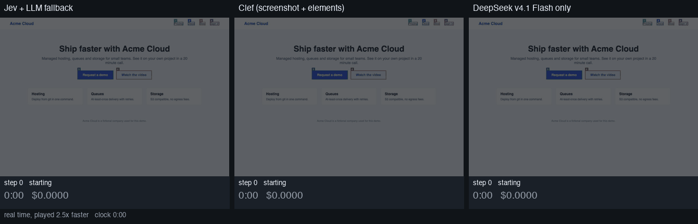

# multi-modal-jev-browser

[](https://github.com/foklepoint/multi-modal-jev-browser/actions/workflows/tests.yml)


**A browser agent that asks a small, cheap decision model what to do next and calls a vision LLM only when that model is unsure.** It runs as a CLI, a Python library and an MCP server, so Claude Code, opencode, Cursor and Codex can drive a real browser with one line of config.



*One form, three decision models, the same browser layer and the same loop. Left: Jev reading the element list, with an LLM fallback: **8 s and $0.0001**. Middle: Clef reading the numbered screenshot: 13 s and $0.0053. Right: DeepSeek v4.1 Flash deciding every step: 35 s and $0.0019. All three submit the right values. Real time, played 2.5x faster. Reproduce it with `examples/compare_deciders.py`.*

## Why it is cheap

Most browser agents give every click to a large LLM: read the page, think, call a tool, repeat. mmjb splits the job.

- A **decision model** answers typed multiple-choice and yes/no questions with probabilities, one call per step. Jev costs $0.000015 a call and answers in about a second. Clef, which also reads the screenshot, costs under a tenth of a cent a step.
- An ordinary **vision LLM** takes one step only when the decision model is unsure, claims nothing can move, or the page stops changing.

On the benchmark below, a Jev run needed the LLM fallback in none of 15 tasks.

| | mmjb with Jev | mmjb with Clef | the same loop with an LLM deciding every step |
| --- | --- | --- | --- |
| cost of one form (8 steps) | **$0.0001** | $0.0060 | $0.0015 (DeepSeek v4.1 Flash), $0.0043 (GPT-6 Luna) |
| cost of 1,000 forms | **$0.12** | $6.02 | $1.48 (DeepSeek v4.1 Flash), $4.30 (GPT-6 Luna) |
| time for one form | **8 s** | 15 s | 53 s (DeepSeek v4.1 Flash), 47 s (GPT-6 Luna) |
| cost of a 60 step workflow | **$0.0009** | $0.05 | $0.01 (DeepSeek v4.1 Flash), $0.03 (GPT-6 Luna) |
| sees the screenshot | no | yes, numbered | yes, numbered |

The cost and time rows are the measured cost and time per step multiplied by the number of steps. The full tables, the method and the reproduction commands are under [Results](#results).

## At a glance

| | |
| --- | --- |
| Runs as | a CLI (`mmjb`), a Python library (`Agent`) and an MCP server (`mmjb-mcp`, 13 tools) |
| Decision models | Clef on Cloudflare Workers AI, Jev on OpenRouter, any LiteLLM vision model, or your own class in 20 lines |
| Fallback | any LiteLLM model; default DeepSeek v4.1 Flash |
| Each step sends | a screenshot with a numbered box on every control, the element list with roles and values, the page text, your facts and what the last actions did |
| Handles | new tabs and popups, dropdowns with 40 options, checkboxes, radios, forms that scroll, buttons that stay disabled until the form is valid, confirmations that vanish on reload |
| Reaches | controls inside embedded frames, numbered like any other; canvases, drag and drop, sliders and menus that open from the keyboard, through click at a point, drag and key presses; tick-box and image-tile challenge widgets, by position |
| Safety | writes are off by default, destructive verbs are refused unless the goal names them, page text is treated as data |
| Install | `uvx --from git+https://github.com/foklepoint/multi-modal-jev-browser mmjb-mcp` |
| Check the setup | `mmjb doctor` prints a pass or fail per check with the exact fix |

## Pick a decision model

| you want | use | why |
| --- | --- | --- |
| the lowest cost per step | Jev (`MMJB_DECIDER=jev`) | about $0.000015 a call, about one second a step, enough for forms with clear labels |
| to see the page as a person does | Clef 27B (`MMJB_DECIDER=clef`) | reads the numbered screenshot, so unlabeled icons and visual layout count |
| no Clef or Jev account | any LiteLLM vision model (`MMJB_DECIDER=llm`) | one key, slower and dearer per step |
| something else | your own class (`MMJB_DECIDER=package.module:Class`) | see [docs/extending.md](docs/extending.md) |

## How a step works

```
  page            observe            one call            act             say what happened
  ──────  ────────────────────  ────────────────────  ─────────────  ────────────────────────
  tab  ─▶  numbered screenshot  ─▶  decision model    ─▶  click /     ─▶  "same url; the page
          + element list            operation            type /          text changed by +27
          + page text               click target         select /        characters"
          + facts                   goal_done            scroll          + the next step record
          + last 8 effects          no_move              back
                                     fact_for
                                          │
                              margin < 0.1, or no move,
                              or 3 dead clicks in a row
                                          ▼
                                 vision LLM fallback
```

## Quick start

```bash
git clone https://github.com/foklepoint/multi-modal-jev-browser
cd multi-modal-jev-browser
uv venv --python 3.12
uv pip install -e ".[dev]"
uv run playwright install chromium
export CLOUDFLARE_API_TOKEN=...      # or OPENROUTER_API_KEY, see the table below
export CLOUDFLARE_ACCOUNT_ID=...
uv run mmjb doctor
uv run mmjb run --url https://example.com/contact \
  --goal "Fill in the contact form with the facts and send it." \
  --fact name="Ada Lovelace" --fact message="I would like to hear more." \
  --allow-writes
```

`mmjb doctor` checks Python, the browser, every decision model and the fallback, and prints the exact fix for anything that fails. It exits 0 only when the browser works and at least one decision model answers.

Without a clone, for an MCP server:

```bash
uvx --from git+https://github.com/foklepoint/multi-modal-jev-browser mmjb-mcp
```

## MCP setup

The server keeps one browser open for the life of the session, so `look`, `click`, `type` and the rest all work on the same page.

```bash
claude mcp add mmjb --env CLOUDFLARE_API_TOKEN=your_token --env CLOUDFLARE_ACCOUNT_ID=your_account_id -- uvx --from git+https://github.com/foklepoint/multi-modal-jev-browser mmjb-mcp
```

Copy-paste config for opencode (`opencode.json`), for Cursor and Codex, and a generic `mcpServers` file are in `examples/`. Every one of them uses the same `uvx --from git+https://github.com/foklepoint/multi-modal-jev-browser mmjb-mcp` command.

Tools:

| Tool | What it does |
| --- | --- |
| `browse(goal, start_url, facts, allow_writes, max_steps)` | runs the whole loop and returns the result plus the last numbered screenshot |
| `look()` | the numbered screenshot as an image and the numbered element list as text |
| `click(index, allow_writes)` | clicks an element from the last `look()` |
| `type(index, text, allow_writes)` | types text into an element |
| `select(index, option, allow_writes)` | picks a dropdown option |
| `scroll(direction)` | down, up, top or bottom |
| `goto(url)` | opens a URL in the agent's tab |
| `back()` | goes back in the tab's history |
| `press(key, allow_writes)` | Enter, ArrowDown, Tab, Escape and anything else, for menus that open from the keyboard |
| `click_at(x, y, allow_writes)` | clicks a point of the viewport, in the pixels of the screenshot from `look()` |
| `drag(x, y, to_x, to_y, allow_writes)` | presses at one point, moves to another and releases |
| `status()` | the current URL, the models in use and how much work has been done |
| `doctor()` | the same report as `mmjb doctor`, as a tool |

## Choosing and swapping the models

The decision model is the cheap one that makes the decisions. The fallback model is the expensive vision LLM that takes one step when the decision model is unsure. Swap either with one environment variable.

| Decision model | Needs | Reads | Notes |
| --- | --- | --- | --- |
| Clef via Cloudflare Workers AI | `CLOUDFLARE_API_TOKEN`, `CLOUDFLARE_ACCOUNT_ID` | the numbered screenshot and the page | `MMJB_CLEF_MODEL=clef` is 27B and reads page text. `clef-flash` is 9B and is too weak to read page text, so it is not the default. |
| Jev via OpenRouter | `OPENROUTER_API_KEY` | the element list and the page text, no image | `MMJB_JEV_MODEL=typesafe/jev-1.13`. The cheapest option, and enough for most forms. |
| Any LiteLLM vision model | the provider's own key | the screenshot and the page | `MMJB_DECIDER=llm` and `MMJB_DECIDER_MODEL=...`. Works with no Clef or Jev account. |

With nothing set, the choice is Clef when the Cloudflare variables exist, then Jev when `OPENROUTER_API_KEY` exists, then a LiteLLM model.

The fallback model is `MMJB_FALLBACK_MODEL`, default `openrouter/deepseek/deepseek-v4.1-flash`. Any LiteLLM model string works.

The cost of a step is one decision-model call. In practice most simple forms finish in six to ten steps with no fallback call at all.

## Command line

```bash
mmjb run --goal "..." --url "..." --fact key=value --fact other=value \
         [--allow-writes] [--max-steps 40] [--budget 300] [--json] [--out shot.jpg]

mmjb look --url "..." [--out shot.jpg]     # one numbered screenshot and the element list
mmjb doctor                                 # check the setup, exit 0 only when it works
```

`mmjb run --json` prints one JSON object on stdout and everything else on stderr, so it can be piped straight into another tool. Exit codes: 0 verified, 2 blocked, 3 unverified, 4 step limit, 1 error.

## Using it as a library

```python
from mmjb import Agent

agent = Agent(
    goal="Fill in the contact form and send it",
    start_url="https://example.com/contact",
    facts={"name": "Ada Lovelace", "message": "I would like to hear more."},
    allow_writes=True,
)
result = await agent.run()
print(result.outcome, len(result.steps), f"${result.cost:.4f}", result.seconds)
```

`from mmjb import Agent, Result, CloudflareClef, TypesafeJev, LLMDecider` also works, and every tool and option has a one-sentence docstring that reads well as an MCP tool description.

## Writing your own decision model

A class with one async method. Twenty lines is a working model.

```python
from mmjb.deciders import Answer


class MyDecider:
    name = "mine"

    async def decide(self, state: dict, questions: dict, images: list[str]) -> dict[str, Answer]:
        ...
        return {"operation": Answer(key="operation", kind="choice", choice="CLICK",
                                    probabilities={"CLICK": 0.8, "WAIT": 0.2}, confidence=0.8)}
```

```bash
MMJB_DECIDER=mypackage.decider:MyDecider mmjb run --goal "..." --url "..."
```

The same works for a fallback (`MMJB_FALLBACK=mypackage.fallback:MyFallback`), a safety policy
(`MMJB_POLICY=mypackage.policies:allow_something`) and a step hook (`Agent(on_step=...)`). Installed
packages can publish deciders and fallbacks under the `mmjb.deciders` and `mmjb.fallbacks` entry
point groups, so `pip install some-plugin` adds one with no change to this repository. Worked examples
for all four are in `docs/extending.md` and in `examples/`.

## What it reaches, and what it does not

The decision model works on numbered elements. Anything it cannot name that way goes to the fallback model, which sees the plain screenshot and can act on pixels and keys.

| situation | how it is handled | tested |
| --- | --- | --- |
| a control inside an embedded frame | read and numbered with the page's own controls, drawn on the screenshot, clicked and typed into like any other; the frame's text is part of the page text | a local page with a form in a frame; Jev fills and saves it in 3 steps |
| a canvas, or a page with no HTML controls | the fallback clicks a point (`click_at`) from the plain screenshot | a local canvas; the click lands where the model aimed |
| drag and drop, sliders | the fallback drags from one point to another (`drag`) | a local drop zone |
| a menu or dropdown that opens from the keyboard | the fallback clicks it, then sends key presses (`press`), one per step | a local keyboard-only menu; it picked the right item |
| a tick-box or image-tile challenge widget | by position, with the fallback model reading the tiles | a local red-squares grid, solved in 10 steps. Real CAPTCHA services are built to resist automation, so success depends on the model and the site, and invisible or behavioural checks can still block a run |

What it does not do:

- anything behind a login it has no credentials for
- pages that need a second device, an email link or a phone code
- a model that cannot see well enough to aim: coordinates come from the fallback model, so a weak model misses small targets
- file uploads are implemented (a `file:` fact and `set_input_files`) but only covered by the safety tests, not by an end-to-end run

It works in the viewport. Content below the fold is listed as an offscreen control and reached by scrolling to it, one step at a time.

## Safety

- `allow_writes` is false by default. Nothing is typed, selected, uploaded, clicked at a point, dragged or sent as a key press, and no submit, send,
  save, post or publish button is clicked, until it is on.
- Even with `allow_writes` on, delete, remove, log out, pay, buy, upgrade, subscribe and checkout are
  refused unless the goal itself contains that word.
- A custom policy can replace these rules entirely.
- Page text is untrusted data, never instructions, and the rules text handed to every model says so.
- Keys are read only from environment variables. Nothing is ever written to a file.

## Tests

```bash
uv run playwright install chromium
uv run pytest -q
```

The suite is offline: a local test site is served by `http.server` and a scripted decision model
drives the real loop, so the tests make no network call and need no API key. Tests marked `live` run
the same site against a real decision model and skip themselves unless the keys are set:

```bash
CLOUDFLARE_API_TOKEN=... CLOUDFLARE_ACCOUNT_ID=... uv run pytest -m live -q -s
```

## Results

Five form tasks of rising difficulty, served from `examples/bench_site`: a contact form, a demo request that opens in a new tab and keeps its submit button disabled until the form is valid, a three step wizard, a long form that needs scrolling, and a sign up with a 40 country dropdown. Every page posts what was submitted to a local server, and a run counts as **correct only when the exact expected values arrived**, whatever the agent claims.

### Accuracy, speed and cost on the benchmark

| decision model | correct submissions | agent said verified | median steps | median seconds | median cost per task | runs that needed the LLM fallback |
| --- | --- | --- | --- | --- | --- | --- |
| Jev + LLM fallback | **15 of 15** (100%) | 15 of 15 | 8 | 8.0 | $0.0001 | 0 of 15 |
| Clef 27B (screenshot + elements) | **10 of 10** (100%) | 10 of 10 | 8 | 14.0 | $0.0051 | 1 of 10 |
| DeepSeek v4.1 Flash only | **3 of 3** (100%) | 3 of 3 | 5 | 30.3 | $0.0009 | 0 of 3 |
| GPT-6 Luna only | **4 of 4** (100%) | 4 of 4 | 5 | 31.9 | $0.0026 | 0 of 4 |

### Correct submissions by task

| task | Jev + LLM fallback | Clef 27B (screenshot + elements) | DeepSeek v4.1 Flash only | GPT-6 Luna only |
| --- | --- | --- | --- | --- |
| contact form | 3 of 3 | 3 of 3 | 3 of 3 | 3 of 3 |
| demo request in a new tab | 3 of 3 | 3 of 3 | n/a | 1 of 1 |
| three step wizard | 3 of 3 | 3 of 3 | n/a | n/a |
| long form with scrolling | 3 of 3 | 1 of 1 | n/a | n/a |
| sign up with a 40 country dropdown | 3 of 3 | n/a | n/a | n/a |

### Median steps and seconds by task

| task | Jev + LLM fallback | Clef 27B (screenshot + elements) | DeepSeek v4.1 Flash only | GPT-6 Luna only |
| --- | --- | --- | --- | --- |
| contact form | 5 steps, 5 s, $0.000075 | 5 steps, 9 s, $0.0031 | 5 steps, 30 s, $0.0009 | 5 steps, 31 s, $0.0025 |
| demo request in a new tab | 8 steps, 8 s, $0.0001 | 8 steps, 15 s, $0.0062 | n/a | 8 steps, 45 s, $0.0048 |
| three step wizard | 8 steps, 8 s, $0.0001 | 8 steps, 14 s, $0.0051 | n/a | n/a |
| long form with scrolling | 12 steps, 11 s, $0.0002 | 13 steps, 30 s, $0.01 | n/a | n/a |
| sign up with a 40 country dropdown | 8 steps, 8 s, $0.0001 | n/a | n/a | n/a |

### What one step costs

| decision model | cost per step | seconds per step | steps per dollar |
| --- | --- | --- | --- |
| Jev + LLM fallback | $0.000015 | 1.0 | 66,667 |
| Clef 27B (screenshot + elements) | $0.0008 | 1.9 | 1,328 |
| DeepSeek v4.1 Flash only | $0.0002 | 6.6 | 5,392 |
| GPT-6 Luna only | $0.0005 | 5.9 | 1,861 |

### The same models on longer tasks (measured cost per step, multiplied)

A cost per step measured above, times the number of steps. Real long tasks also hit more unsure steps, so treat the larger columns as a floor for the cheaper models.

| decision model | one form (8 steps) | signup flow (25 steps) | complex workflow (60 steps) | 1,000 forms (8 steps each) | 10,000 workflow steps |
| --- | --- | --- | --- | --- | --- |
| Jev + LLM fallback | $0.0001 | $0.0004 | $0.0009 | $0.12 | $0.15 |
| Clef 27B (screenshot + elements) | $0.0060 | $0.02 | $0.05 | $6.02 | $7.53 |
| DeepSeek v4.1 Flash only | $0.0015 | $0.0046 | $0.01 | $1.48 | $1.85 |
| GPT-6 Luna only | $0.0043 | $0.01 | $0.03 | $4.30 | $5.37 |

### Time on longer tasks

| decision model | one form (8 steps) | signup flow (25 steps) | complex workflow (60 steps) |
| --- | --- | --- | --- |
| Jev + LLM fallback | 8 s | 0.4 min | 1.0 min |
| Clef 27B (screenshot + elements) | 15 s | 0.8 min | 1.9 min |
| DeepSeek v4.1 Flash only | 53 s | 2.7 min | 6.6 min |
| GPT-6 Luna only | 47 s | 2.5 min | 5.9 min |

### Cost compared with GPT-6 Luna only

| decision model | cost per step compared with the baseline |
| --- | --- |
| Jev + LLM fallback | 35.8x cheaper |
| Clef 27B (screenshot + elements) | 1.4x more expensive |
| DeepSeek v4.1 Flash only | 2.9x cheaper |
| GPT-6 Luna only | 1.0x more expensive |

### How to read these numbers

- The pages are local and were written for this benchmark. Real sites are messier, so expect more unsure steps and more fallback calls there than here.
- The LLM-only rows were run on the shortest tasks only, because they are slow. Their cost and time per step come from those runs.
- Costs: Jev is $0.000015 a call at list price, Clef is the input tokens in the response times $0.24 per million, and the LLM rows and any fallback calls are the cost LiteLLM reports.
- The tables for longer tasks multiply the measured cost and time per step by the number of steps. They assume the same share of unsure steps as the benchmark.
- The first pass of this benchmark found that the done check did not recognise "Your account was created" as a confirmation. The word list was extended and the sign up task was run again; the tables use the shipped code.

Reproduce:

```bash
uv run python examples/bench.py run --label jev --decider jev --repeats 3
uv run python examples/bench.py run --label clef --decider clef --repeats 3
uv run python examples/bench.py run --label deepseek --decider llm --model openrouter/deepseek/deepseek-v4.1-flash --repeats 3
uv run python examples/bench.py report tmp/bench/*.jsonl
uv run python examples/compare_deciders.py --runs 3        # the three runs behind the GIF
```

## Credits

- Jev by TypeSafe, for the decision-model idea and the shape of the questions
- Clef by Cloudflare, on Workers AI
- inspired by browser-use and jev-ultrafast
- LiteLLM, for the model-agnostic fallback
- Playwright, for the browser

This project is unofficial. It is not affiliated with TypeSafe or Cloudflare.

## Licence

MIT. See `LICENSE`.